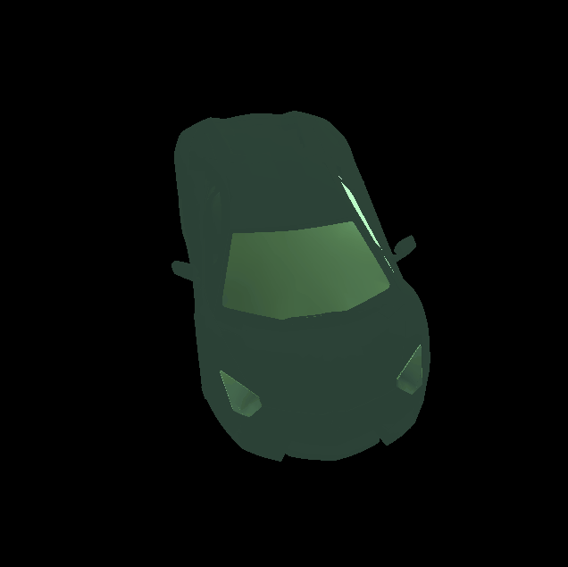
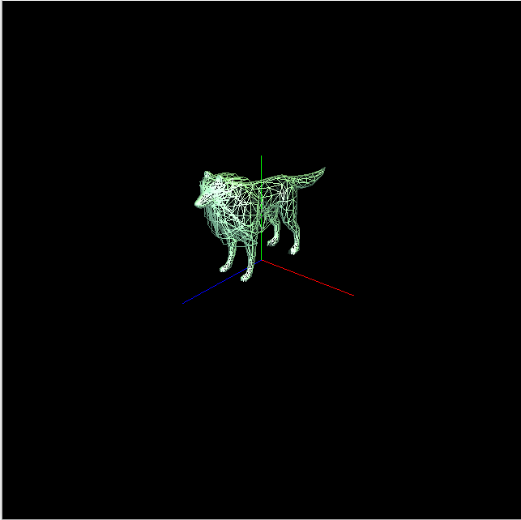

# 3D-.obj-File-Viewer
Python script that renders .obj files using OpenGL

High Polygon Model of an Aventador:

# Controls
- Press 1 to rotate 10° to the left with respect to the coordinates
- Press 3 to rotate 10° to the right with respect to the coordinates

- Press 2 to move the camera up with respects to the coordinates.
- Press W to move the camera up with respects to the coordinates.

- Press A to zoom in.
- Press S to zoom out.

- Press Z to Toggle between Wireframe and Fill mode.

- Press V to reset the view.

